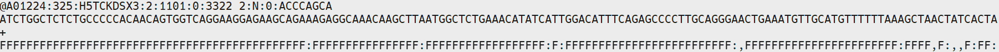

# 5 组间差异表达分析

为了比较同一种细胞亚型在不同样品之间的差异情况，对同一cluster中的不同分组进行组间差异分析。差异分析结果如下表所示：

## **5.1 差异表达基因分析**

相同Cluster不同样品间的差异分析结果文件路径：BMK\_3\_seurat\_analysis/BMK\_3\_Integrated/BMK\_5\_Group\_Anlysis

**表17 差异结果统计表**

| Groups | deg\_group | cluster0 | cluster1 | cluster2 | cluster3 | cluster4 | cluster5 | cluster6 | cluster7 | cluster8 | cluster9 | cluster10 | cluster11 |
| ------ | ---------- | -------- | -------- | -------- | -------- | -------- | -------- | -------- | -------- | -------- | -------- | --------- | --------- |
| group1 | M1\_vs\_M2 | 1        | 5        | 2        | 12       | 4        | 11       | 2        | 103      | 4        | 2        | 4         | 1         |

利用热图展示组间TOP10的差异基因在分组中的表达分布模式。

 (1).png>)

_注：将数据按照各亚群各个分组分开，图片展示了某差异分组(A\_vs\_B)在所有亚群中的差异情况。行表示基因（每个亚群选取top10），列表示各细胞亚群。_

### **5.1.1 top差异基因展示**

利用小提琴图、t-SNE图和UMAP图展示组间TOP2的差异基因在比较组中的表达分布情况。

.png>)

注：展示cluster的top2的 marker 基因在不同样本间的表达分布。不同样本用不同颜色表示，横轴标出样本名，纵轴表示基因在对应cluster中的表达。

.png>)

_注: top2 marker基因所有细胞类型中表达值在t-SNE聚类结果中的可视化，每张图中红色标记的细胞即为特异表达该 marker 基因的细胞类型。_

.png>)

_注: top2 marker基因所有细胞类型中表达值在UMAP聚类结果中的可视化，每张图中红色标记的细胞即为特异表达该 marker 基因的细胞类型。_

各差异分组差异基因展示结果文件路径：BMK\_3\_seurat\_analysis/BMK\_3\_Integrated/BMK\_5\_Group\_Anlysis/\*/BMK\_2\_Topmarker/

各差异分组差异基因展示结果文件下载链接（展示一个分组）

## **5.2 差异表达基因注释**

将得到的差异基因与NR\[8]，Swiss-Prot\[9]，GO\[10]，COG\[11]，KOG\[12]，Pfam\[13]，KEGG\[14]，Reactome\[15]数据库进行序列比对，得到基因的注释信息。

**表18 差异表达基因注释文件**

| ID                 | symbol  | Pvalue               | log2FC | pct.1 | pct.2 | Qvalue               | M2\_count | M1\_count | COG\_class | COG\_class\_annotation | KEGG\_annotation                                                                                                                                  | KEGG\_pathway\_annotation                              | KOG\_class | KOG\_class\_annotation           | Pfam\_annotation                                                       | Swiss-Prot\_annotation                                                  | eggNOG\_class | eggNOG\_class\_annotation             | NR\_annotation                                          | GO\_annotation                                                                                                                                                                                                                                                                                                                                                                                                                                                                                                                                                                                                                                                                                                                                                                                                                                                                                                                                                                                                                                                                                                                                                                                                                                                                                                                                                                                                                                                                                                                                                                                                                                                                                                                                                                                                                                                                                                                                                                                                                                                                                                                                                                                                                                                                                                                                                                                                                                                                                                                                                                                                                                                                                                                                                                                                                                                                                                                                                                                                                                                                                                                                                                                                                                                                                                                                                                                                                                                                                                                                                                                                                                                                                                                                                                                                                                                                                                                                                                                                                                                                                                                                                                                                                                                                                                                                                                                                                                                                                                                                                                                                                                                                                                                                                                                                                                                                                                                                                                                                                                                                                                                                                                                                                                                                                                                                                                                                                                                                                                                                                                                                                                                                                                                                                                                                                                                                                                                                                                                                                                                                                                                                                                                                                                                                                                                                                                                                                                                                                                                                                                                                                                                                                                                                                                                                                                                                                                                                                                                                                                                                                                                                                                                                                                                                                                                                                                                                                                                                                                                                                                                                                                                                                                                                                                                                                                                                                                                                                                                                                                                                                                                                                                                                                                                                                                                  |
| ------------------ | ------- | -------------------- | ------ | ----- | ----- | -------------------- | --------- | --------- | ---------- | ---------------------- | ------------------------------------------------------------------------------------------------------------------------------------------------- | ------------------------------------------------------ | ---------- | -------------------------------- | ---------------------------------------------------------------------- | ----------------------------------------------------------------------- | ------------- | ------------------------------------- | ------------------------------------------------------- | ------------------------------------------------------------------------------------------------------------------------------------------------------------------------------------------------------------------------------------------------------------------------------------------------------------------------------------------------------------------------------------------------------------------------------------------------------------------------------------------------------------------------------------------------------------------------------------------------------------------------------------------------------------------------------------------------------------------------------------------------------------------------------------------------------------------------------------------------------------------------------------------------------------------------------------------------------------------------------------------------------------------------------------------------------------------------------------------------------------------------------------------------------------------------------------------------------------------------------------------------------------------------------------------------------------------------------------------------------------------------------------------------------------------------------------------------------------------------------------------------------------------------------------------------------------------------------------------------------------------------------------------------------------------------------------------------------------------------------------------------------------------------------------------------------------------------------------------------------------------------------------------------------------------------------------------------------------------------------------------------------------------------------------------------------------------------------------------------------------------------------------------------------------------------------------------------------------------------------------------------------------------------------------------------------------------------------------------------------------------------------------------------------------------------------------------------------------------------------------------------------------------------------------------------------------------------------------------------------------------------------------------------------------------------------------------------------------------------------------------------------------------------------------------------------------------------------------------------------------------------------------------------------------------------------------------------------------------------------------------------------------------------------------------------------------------------------------------------------------------------------------------------------------------------------------------------------------------------------------------------------------------------------------------------------------------------------------------------------------------------------------------------------------------------------------------------------------------------------------------------------------------------------------------------------------------------------------------------------------------------------------------------------------------------------------------------------------------------------------------------------------------------------------------------------------------------------------------------------------------------------------------------------------------------------------------------------------------------------------------------------------------------------------------------------------------------------------------------------------------------------------------------------------------------------------------------------------------------------------------------------------------------------------------------------------------------------------------------------------------------------------------------------------------------------------------------------------------------------------------------------------------------------------------------------------------------------------------------------------------------------------------------------------------------------------------------------------------------------------------------------------------------------------------------------------------------------------------------------------------------------------------------------------------------------------------------------------------------------------------------------------------------------------------------------------------------------------------------------------------------------------------------------------------------------------------------------------------------------------------------------------------------------------------------------------------------------------------------------------------------------------------------------------------------------------------------------------------------------------------------------------------------------------------------------------------------------------------------------------------------------------------------------------------------------------------------------------------------------------------------------------------------------------------------------------------------------------------------------------------------------------------------------------------------------------------------------------------------------------------------------------------------------------------------------------------------------------------------------------------------------------------------------------------------------------------------------------------------------------------------------------------------------------------------------------------------------------------------------------------------------------------------------------------------------------------------------------------------------------------------------------------------------------------------------------------------------------------------------------------------------------------------------------------------------------------------------------------------------------------------------------------------------------------------------------------------------------------------------------------------------------------------------------------------------------------------------------------------------------------------------------------------------------------------------------------------------------------------------------------------------------------------------------------------------------------------------------------------------------------------------------------------------------------------------------------------------------------------------------------------------------------------------------------------------------------------------------------------------------------------------------------------------------------------------------------------------------------------------------------------------------------------------------------------------------------------------------------------------------------------------------------------------------------------------------------------------------------------------------------------------------------------------------------------------------------------------------------------------------------------------------------------------------------------------------------------------------------------------------------------------------------------------------------------------------------------------------------------------------------------------------------------------------------------------------------------------- |
| ENSMUSG00000002985 | Apoe    | 1.71100637878251e-67 | 2.74   | 0.97  | 0.54  | 3.26614007645793e-63 | 27.12     | 3.21      | --         | --                     | K04524\|0\|mmu:11816\|K04524 apolipoprotein E \| (RefSeq) Apoe, AI255918, Apo-E; apolipoprotein E                                                 | Alzheimer's disease (ko05010)                          | --         | --                               | Apolipoprotein A1/A4/E domain                                          | Apolipoprotein E OS=Mus musculus OX=10090 GN=Apoe PE=1 SV=2             | Z             | Cytoskeleton                          | apolipoprotein E precursor \[Mus musculus]              | Molecular Function: amyloid-beta binding (GO:0001540);; Biological Process: negative regulation of endothelial cell proliferation (GO:0001937);; Biological Process: response to dietary excess (GO:0002021);; Molecular Function: phospholipid binding (GO:0005543);; Cellular Component: nuclear envelope (GO:0005635);; Cellular Component: lysosome (GO:0005764);; Cellular Component: early endosome (GO:0005769);; Cellular Component: late endosome (GO:0005770);; Cellular Component: endoplasmic reticulum (GO:0005783);; Cellular Component: Golgi apparatus (GO:0005794);; Cellular Component: microtubule (GO:0005874);; Biological Process: cholesterol catabolic process (GO:0006707);; Biological Process: cellular calcium ion homeostasis (GO:0006874);; Biological Process: receptor-mediated endocytosis (GO:0006898);; Biological Process: response to oxidative stress (GO:0006979);; Biological Process: G-protein coupled receptor signaling pathway (GO:0007186);; Biological Process: nitric oxide mediated signal transduction (GO:0007263);; Biological Process: aging (GO:0007568);; Molecular Function: heparin binding (GO:0008201);; Biological Process: response to zinc ion (GO:0010043);; Biological Process: regulation of gene expression (GO:0010468);; Biological Process: negative regulation of platelet activation (GO:0010544);; Biological Process: positive regulation of cholesterol esterification (GO:0010873);; Biological Process: positive regulation of cholesterol efflux (GO:0010875);; Biological Process: lipid transport involved in lipid storage (GO:0010877);; Biological Process: peripheral nervous system axon regeneration (GO:0014012);; Molecular Function: cholesterol binding (GO:0015485);; Biological Process: long-chain fatty acid transport (GO:0015909);; Molecular Function: antioxidant activity (GO:0016209);; Biological Process: protein import (GO:0017038);; Molecular Function: cholesterol transporter activity (GO:0017127);; Biological Process: virion assembly (GO:0019068);; Biological Process: triglyceride catabolic process (GO:0019433);; Biological Process: cGMP-mediated signaling (GO:0019934);; Cellular Component: dendrite (GO:0030425);; Biological Process: positive regulation of cGMP biosynthetic process (GO:0030828);; Cellular Component: extracellular matrix (GO:0031012);; Cellular Component: extrinsic component of external side of plasma membrane (GO:0031232);; Biological Process: regulation of Cdc42 protein signal transduction (GO:0032489);; Biological Process: response to retinoic acid (GO:0032526);; Biological Process: positive regulation of low-density lipoprotein particle receptor catabolic process (GO:0032805);; Biological Process: response to insulin (GO:0032868);; Cellular Component: very-low-density lipoprotein particle (GO:0034361);; Cellular Component: low-density lipoprotein particle (GO:0034362);; Cellular Component: intermediate-density lipoprotein particle (GO:0034363);; Cellular Component: discoidal high-density lipoprotein particle (GO:0034365);; Biological Process: very-low-density lipoprotein particle remodeling (GO:0034372);; Biological Process: low-density lipoprotein particle remodeling (GO:0034374);; Biological Process: high-density lipoprotein particle remodeling (GO:0034375);; Biological Process: high-density lipoprotein particle assembly (GO:0034380);; Biological Process: chylomicron remnant clearance (GO:0034382);; Biological Process: high-density lipoprotein particle clearance (GO:0034384);; Biological Process: very-low-density lipoprotein particle clearance (GO:0034447);; Biological Process: lipoprotein biosynthetic process (GO:0042158);; Biological Process: lipoprotein catabolic process (GO:0042159);; Biological Process: vasodilation (GO:0042311);; Cellular Component: chylomicron (GO:0042627);; Biological Process: cholesterol homeostasis (GO:0042632);; Molecular Function: protein homodimerization activity (GO:0042803);; Cellular Component: neuronal cell body (GO:0043025);; Biological Process: negative regulation of MAP kinase activity (GO:0043407);; Biological Process: negative regulation of neuron apoptotic process (GO:0043524);; Biological Process: negative regulation of blood vessel endothelial cell migration (GO:0043537);; Biological Process: reverse cholesterol transport (GO:0043691);; Biological Process: positive regulation by host of viral process (GO:0044794);; Biological Process: response to ethanol (GO:0045471);; Biological Process: negative regulation of cholesterol biosynthetic process (GO:0045541);; Biological Process: positive regulation of axon extension (GO:0045773);; Molecular Function: hydroxyapatite binding (GO:0046848);; Biological Process: positive regulation of lipid biosynthetic process (GO:0046889);; Molecular Function: metal chelating activity (GO:0046911);; Molecular Function: tau protein binding (GO:0048156);; Biological Process: oligodendrocyte differentiation (GO:0048709);; Biological Process: artery morphogenesis (GO:0048844);; Biological Process: negative regulation of inflammatory response (GO:0050728);; Molecular Function: low-density lipoprotein particle receptor binding (GO:0050750);; Biological Process: positive regulation of nitric-oxide synthase activity (GO:0051000);; Biological Process: positive regulation of membrane protein ectodomain proteolysis (GO:0051044);; Biological Process: maintenance of location in cell (GO:0051651);; Biological Process: fatty acid homeostasis (GO:0055089);; Molecular Function: phosphatidylcholine-sterol O-acyltransferase activator activity (GO:0060228);; Biological Process: positive regulation of dendritic spine development (GO:0060999);; Biological Process: negative regulation of dendritic spine development (GO:0061000);; Cellular Component: extracellular exosome (GO:0070062);; Molecular Function: very-low-density lipoprotein particle receptor binding (GO:0070326);; Biological Process: triglyceride homeostasis (GO:0070328);; Biological Process: cellular response to interleukin-1 (GO:0071347);; Biological Process: cellular response to growth factor stimulus (GO:0071363);; Biological Process: cellular response to cholesterol (GO:0071397);; Molecular Function: lipoprotein particle binding (GO:0071813);; Cellular Component: blood microparticle (GO:0072562);; Biological Process: negative regulation of triglyceride metabolic process (GO:0090209);; Biological Process: negative regulation of cholesterol efflux (GO:0090370);; Biological Process: AMPA glutamate receptor clustering (GO:0097113);; Biological Process: NMDA glutamate receptor clustering (GO:0097114);; Biological Process: cellular oxidant detoxification (GO:0098869);; Biological Process: regulation of amyloid-beta clearance (GO:1900221);; Biological Process: positive regulation of neuron death (GO:1901216);; Biological Process: negative regulation of postsynaptic membrane organization (GO:1901627);; Biological Process: positive regulation of postsynaptic membrane organization (GO:1901628);; Biological Process: negative regulation of presynaptic membrane organization (GO:1901630);; Biological Process: positive regulation of presynaptic membrane organization (GO:1901631);; Biological Process: positive regulation of amyloid-beta formation (GO:1902004);; Biological Process: negative regulation of amyloid-beta formation (GO:1902430);; Biological Process: regulation of tau-protein kinase activity (GO:1902947);; Biological Process: negative regulation of dendritic spine maintenance (GO:1902951);; Biological Process: positive regulation of dendritic spine maintenance (GO:1902952);; Biological Process: positive regulation of phospholipid efflux (GO:1902995);; Biological Process: positive regulation of neurofibrillary tangle assembly (GO:1902998);; Biological Process: negative regulation of phospholipid efflux (GO:1902999);; Biological Process: negative regulation of lipid transport across blood brain barrier (GO:1903001);; Biological Process: positive regulation of lipid transport across blood brain barrier (GO:1903002);; |
| ENSMUSG00000027375 | Mal     | 3.23201075936551e-28 | -1.18  | 0.2   | 0.57  | 6.16958533855283e-24 | 0.53      | 2.47      | --         | --                     | --                                                                                                                                                | --                                                     | \[V]       | Defense mechanisms               | Membrane-associating domain                                            | Myelin and lymphocyte protein OS=Mus musculus OX=10090 GN=Mal PE=2 SV=1 | S             | Function unknown                      | myelin and lymphocyte protein isoform 1 \[Mus musculus] | Biological Process: membrane raft polarization (GO:0001766);; Cellular Component: endoplasmic reticulum (GO:0005783);; Cellular Component: Golgi apparatus (GO:0005794);; Cellular Component: plasma membrane (GO:0005886);; Biological Process: intracellular protein transport (GO:0006886);; Cellular Component: integral component of membrane (GO:0016021);; Cellular Component: extrinsic component of membrane (GO:0019898);; Molecular Function: structural constituent of myelin sheath (GO:0019911);; Biological Process: myelination (GO:0042552);; Cellular Component: membrane raft (GO:0045121);; Biological Process: positive regulation of extrinsic apoptotic signaling pathway via death domain receptors (GO:1902043);;                                                                                                                                                                                                                                                                                                                                                                                                                                                                                                                                                                                                                                                                                                                                                                                                                                                                                                                                                                                                                                                                                                                                                                                                                                                                                                                                                                                                                                                                                                                                                                                                                                                                                                                                                                                                                                                                                                                                                                                                                                                                                                                                                                                                                                                                                                                                                                                                                                                                                                                                                                                                                                                                                                                                                                                                                                                                                                                                                                                                                                                                                                                                                                                                                                                                                                                                                                                                                                                                                                                                                                                                                                                                                                                                                                                                                                                                                                                                                                                                                                                                                                                                                                                                                                                                                                                                                                                                                                                                                                                                                                                                                                                                                                                                                                                                                                                                                                                                                                                                                                                                                                                                                                                                                                                                                                                                                                                                                                                                                                                                                                                                                                                                                                                                                                                                                                                                                                                                                                                                                                                                                                                                                                                                                                                                                                                                                                                                                                                                                                                                                                                                                                                                                                                                                                                                                                                                                                                                                                                                                                                                                                                                                                                                                                                                                                                                                                                                                                                                                                                                                                                      |
| ENSMUSG00000098178 | Gm42418 | 1.88417335304948e-06 | -1.29  | 0.99  | 0.99  | 0.04                 | 9.35      | 24.29     | --         | --                     | --                                                                                                                                                | --                                                     | --         | --                               | --                                                                     | --                                                                      | --            | --                                    | --                                                      | --                                                                                                                                                                                                                                                                                                                                                                                                                                                                                                                                                                                                                                                                                                                                                                                                                                                                                                                                                                                                                                                                                                                                                                                                                                                                                                                                                                                                                                                                                                                                                                                                                                                                                                                                                                                                                                                                                                                                                                                                                                                                                                                                                                                                                                                                                                                                                                                                                                                                                                                                                                                                                                                                                                                                                                                                                                                                                                                                                                                                                                                                                                                                                                                                                                                                                                                                                                                                                                                                                                                                                                                                                                                                                                                                                                                                                                                                                                                                                                                                                                                                                                                                                                                                                                                                                                                                                                                                                                                                                                                                                                                                                                                                                                                                                                                                                                                                                                                                                                                                                                                                                                                                                                                                                                                                                                                                                                                                                                                                                                                                                                                                                                                                                                                                                                                                                                                                                                                                                                                                                                                                                                                                                                                                                                                                                                                                                                                                                                                                                                                                                                                                                                                                                                                                                                                                                                                                                                                                                                                                                                                                                                                                                                                                                                                                                                                                                                                                                                                                                                                                                                                                                                                                                                                                                                                                                                                                                                                                                                                                                                                                                                                                                                                                                                                                                                                              |
| ENSMUSG00000025351 | Cd63    | 5.87990916413211e-24 | 1.01   | 0.59  | 0.22  | 1.12241586034118e-19 | 1.66      | 0.32      | --         | --                     | K06497\|4.80531e-163\|mmu:12512\|K06497 CD63 antigen \| (RefSeq) Cd63, C75951, ME491, Tspan30; CD63 antigen                                       | Lysosome (ko04142);; Proteoglycans in cancer (ko05205) | \[R]       | General function prediction only | Tetraspanin family                                                     | CD63 antigen OS=Mus musculus OX=10090 GN=Cd63 PE=1 SV=2                 | S             | Function unknown                      | unnamed protein product \[Mus musculus]                 | Biological Process: positive regulation of receptor internalization (GO:0002092);; Cellular Component: extracellular space (GO:0005615);; Cellular Component: lysosomal membrane (GO:0005765);; Cellular Component: integral component of plasma membrane (GO:0005887);; Biological Process: cell-matrix adhesion (GO:0007160);; Cellular Component: cell surface (GO:0009986);; Biological Process: negative regulation of epithelial cell migration (GO:0010633);; Biological Process: protein transport (GO:0015031);; Biological Process: epithelial cell differentiation (GO:0030855);; Cellular Component: endosome lumen (GO:0031904);; Molecular Function: protein complex binding (GO:0032403);; Cellular Component: multivesicular body membrane (GO:0032585);; Biological Process: cellular protein localization (GO:0034613);; Biological Process: endosome to melanosome transport (GO:0035646);; Cellular Component: melanosome (GO:0042470);; Cellular Component: protein complex (GO:0043234);; Biological Process: positive regulation of cell adhesion (GO:0045785);; Cellular Component: extracellular exosome (GO:0070062);; Cellular Component: multivesicular body, internal vesicle (GO:0097487);; Biological Process: regulation of vascular endothelial growth factor signaling pathway (GO:1900746);; Biological Process: regulation of rubidium ion transport (GO:2000680);; Biological Process: positive regulation of integrin-mediated signaling pathway (GO:2001046);;                                                                                                                                                                                                                                                                                                                                                                                                                                                                                                                                                                                                                                                                                                                                                                                                                                                                                                                                                                                                                                                                                                                                                                                                                                                                                                                                                                                                                                                                                                                                                                                                                                                                                                                                                                                                                                                                                                                                                                                                                                                                                                                                                                                                                                                                                                                                                                                                                                                                                                                                                                                                                                                                                                                                                                                                                                                                                                                                                                                                                                                                                                                                                                                                                                                                                                                                                                                                                                                                                                                                                                                                                                                                                                                                                                                                                                                                                                                                                                                                                                                                                                                                                                                                                                                                                                                                                                                                                                                                                                                                                                                                                                                                                                                                                                                                                                                                                                                                                                                                                                                                                                                                                                                                                                                                                                                                                                                                                                                                                                                                                                                                                                                                                                                                                                                                                                                                                                                                                                                                                                                                                                                                                                                                                                                                                                                                                                                                                                                                                                                                                                                                                                                                                                                                                                                                                           |
| ENSMUSG00000069516 | Lyz2    | 2.19807758508679e-30 | 1.62   | 0.71  | 0.25  | 4.19591030217217e-26 | 5.65      | 1.16      | --         | --                     | K13915\|1.29642e-92\|mmu:17105\|K13915 lysozyme C \[EC:3.2.1.17] \| (RefSeq) Lyz2, AI326280, Lys, Lysm, Lyzf2, Lyzs, Lzm, Lzm-s1, Lzp; lysozyme 2 | Salivary secretion (ko04970)                           | --         | --                               | C-type lysozyme/alpha-lactalbumin family;; Transglycosylase SLT domain | Lysozyme C-2 OS=Mus musculus OX=10090 GN=Lyz2 PE=1 SV=2                 | G             | Carbohydrate transport and metabolism | unnamed protein product \[Mus musculus]                 | Cellular Component: Golgi cis cisterna (GO:0000137);; Biological Process: retina homeostasis (GO:0001895);; Molecular Function: lysozyme activity (GO:0003796);; Cellular Component: extracellular space (GO:0005615);; Cellular Component: microvillus (GO:0005902);; Biological Process: cell wall macromolecule catabolic process (GO:0016998);; Biological Process: cytolysis (GO:0019835);; Cellular Component: trans-Golgi network transport vesicle (GO:0030140);; Cellular Component: secretory granule (GO:0030141);; Molecular Function: identical protein binding (GO:0042802);; Cellular Component: rough endoplasmic reticulum lumen (GO:0048237);; Biological Process: defense response to Gram-negative bacterium (GO:0050829);; Biological Process: defense response to Gram-positive bacterium (GO:0050830);; Cellular Component: extracellular exosome (GO:0070062);;                                                                                                                                                                                                                                                                                                                                                                                                                                                                                                                                                                                                                                                                                                                                                                                                                                                                                                                                                                                                                                                                                                                                                                                                                                                                                                                                                                                                                                                                                                                                                                                                                                                                                                                                                                                                                                                                                                                                                                                                                                                                                                                                                                                                                                                                                                                                                                                                                                                                                                                                                                                                                                                                                                                                                                                                                                                                                                                                                                                                                                                                                                                                                                                                                                                                                                                                                                                                                                                                                                                                                                                                                                                                                                                                                                                                                                                                                                                                                                                                                                                                                                                                                                                                                                                                                                                                                                                                                                                                                                                                                                                                                                                                                                                                                                                                                                                                                                                                                                                                                                                                                                                                                                                                                                                                                                                                                                                                                                                                                                                                                                                                                                                                                                                                                                                                                                                                                                                                                                                                                                                                                                                                                                                                                                                                                                                                                                                                                                                                                                                                                                                                                                                                                                                                                                                                                                                                                                                                                                                                                                                                                                                                                                                                                                                                                                                                                                                                                                         |

_注:网页版只展示前6行。_\
_ID:基因ID；_\
_symbol:基因symbol；_\
_Pvalue:显著性p值；_\
_log2FC:差异倍数的log2值；_\
_pct.1:基因在cluster(i) 中有表达的细胞比例；_\
_pct.2:基因在除了cluster(i)中以外所有的cluster中有表达的细胞比例；_\
_Qvalue:校正后的p值；_\
_clusterName：差异基因的cluster；_\
_clusterN\_count：差异基因在clusterN的单个细胞reads数平均值；_\
_其余列:COG，GO，KEGG，KOG，Pfam，Swiss-Prot，eggNOG，NR数据库对应的注释信息。_

M1\_vs\_M2.cluster3.diff\_featuregene.annotation.xls.html

差异表达基因注释结果文件路径：BMK\_3\_seurat\_analysis/BMK\_3\_Integrated/BMK\_5\_Group\_Anlysis/BMK\_1\_\*/BMK\_3\_enrichment/\*/BMK\_1\_Anno/BMK\_1\_Anno/

功能富集分析及基因注释的结果文件下载链接(展示一个样本)

## **5.3 GO功能富集分析**

GO数据库是GO组织（Gene Ontology Consortium）于2000年构建的一个结构化的标准生物学注释系统，旨在建立基因及其产物知识的标准词汇体系，适用于各个物种。GO注释系统是一个有向无环图，包含三个主要分支，即：生物学过程（Biological Process），分子功能（Molecular Function）和细胞组分（Cellular Component）。对每个cluster的差异基因集，采用ClusterProfiler对基因分别进行生物学过程，分子功能和细胞组分的富集分析。富集分析采用超几何检验方法来寻找与整个基因组背景相比显著富集的GO条目。对富集结果得到的Term采用绘制柱状图气泡图等进行可视化。

_注：图中横坐标为对应的GO term,纵坐标为-log10(pvalue)。每个柱子上的数字表示富集到该term的基因数。不同的颜色分别代表GO的三个本体：BP、CC、MF。_

.png>)

_注：图中每一个圆表示一个term，横坐标表示term名称，纵坐标为富集因子（Enrichment Factor），表示差异基因中注释到某term的基因比例与所有基因中注释到该term的基因比例的比值。富集因子越大，表示差异表达基因在该term中的富集水平越显著。圆圈的颜色代表pvalue，pvalue越小，表示差异表达基因在该term中的富集显著性越可靠；圆圈的大小表示term中富集的基因数目，圆圈越大，表示基因越多。_

.png>)

_注：差异表达基因与GO term的网络图.边的颜色代表不同的term,基因节点的颜色代表差异倍数,term节点越大说明富集到该term的基因数目越多。_

对每个cluster的差异基因进行富集分析，富集到的Term做topGO有向无环图。topGO有向无环图能直观展示差异表达基因富集的GO节点（Term）及其层级关系，是差异表达基因GO富集分析的结果图形化展示，分支代表包含关系，从上至下所定义>的功能描述范围越来越具体。差异表达基因的topGO有向无环图如下:\

.png>)

注：对每个GO节点进行富集，最显著的10个节点在图中用方框表示，图中还包含其各层对应关系。每个方框（或椭圆）内给出了该GO节点的内容描述和富集显著性值。不同颜色代表不同的富集显著性，颜色越深，显著性越高。

功能富集分析之GO分析结果文件路径：BMK\_3\_seurat\_analysis/BMK\_3\_Integrated/BMK\_5\_Group\_Anlysis/BMK\_1\_\*/BMK\_3\_enrichment/\*/BMK\_2\_GO\_enrichment/

## **5.4 KEGG功能注释及富集分析**

在生物体内，不同的基因产物相互协调来行使生物学功能，对差异表达基因的通路（Pathway）注释分析有助于进一步解读基因的功能。KEGG（Kyoto Encyclopedia of Genes and Genomes）是系统分析基因功能、基因组信息数据库，它有助于研究者把基因及表达信息作为一个整体网络进行研究。作为有关Pathway的主要公共数据库(Kanehisa,2008），KEGG提供的整合代谢途径(pathway)查询，包括碳水化合物、核苷、氨基酸等的代谢及有机物的生物降解，不仅提供了所有可能的代谢途径，而且对催化各步反应的酶进行了全面的注解，包含有氨基酸序列、PDB库的链接等等，是进行生物体内代谢分析、代谢网络研究的强有力工具。

对差异表达基因KEGG的注释结果按照KEGG中通路类型进行分类，分类图如下图所示：

.png>)

_注：横坐标为注释到该通路下的基因个数及其个数占被注释上的基因总数的比例，纵坐标为KEGG代谢通路的名称。_

差异表达基因的通路注释结果见下图：

.png>)

_注：红色（绿色）框标记的酶与每个cluster差异高（低）表达基因有关，框内的数字代表酶的编号（EC number），而整个通路由多种酶催化的复杂生化反应构成，此通路图中与差异表达基因相关的酶均用颜色标出，根据研究对象间的差异，重点研究某些代谢通路相关基因的差异表达情况，通过通路解释表型差异的根源。_

分析差异表达基因在某一通路上是否发生显著差异（over-presentation）即为差异表达基因的通路富集分析。Pathway显著性富集分析以KEGG数据库中Pathway为单位，应用超几何检验，找出与整个基因组背景相比，在差异表达基因中显著性富集的Pathway。差异表达基因KEGG通路富集分析结果见下图。

.png>)

_注：图中每一个圆表示一个KEGG通路，横坐标表示通路名称，纵坐标为富集因子（Enrichment Factor），表示差异基因中注释到某通路的基因比例与所有基因中注释到该通路的基因比例的比值。富集因子越大，表示差异表达基因在该通路中的富集水平越显著。圆圈的颜色代表pvalue，pvalue越小，表示差异表达基因在该通路中的富集显著性越可靠；圆圈的大小表示通路中富集的基因数目，圆圈越大，表示基因越多。_

.png>)

_注：差异表达基因与KEGG通路的网络图.边的颜色代表不同的通路,基因节点的颜色代表差异倍数,通路节点越大说明富集到该通路的基因数目越多。_

功能富集分析之KEGG分析结果文件路径：BMK\_3\_seurat\_analysis/BMK\_3\_Integrated/BMK\_5\_Group\_Anlysis/BMK\_1\_\*/BMK\_3\_enrichment/\*/BMK\_3\_KEGG\_enrichment/

## **5.5 Reactome功能富集分析**

Reactome\[15]是一个免费的、开源的信号和代谢分子的关系数据库。Reactome数据库搜集了人类相关的反应和生物学通路（包含 13,827 个人类反应，分为 2,536 条通路，涉及 11,374 种蛋白质）。典型的生物学通路包括：中间代谢、信号传导、转录调控、细胞凋亡和疾病。富集结果如下表所示。

**表19 Reactome通路富集表**

| ReactomeID    | Description                                                                                                                 | GeneRatio | BgRatio  | pvalue | p.adjust | qvalue | geneID                                                                      | geneSymbol          | Count |
| ------------- | --------------------------------------------------------------------------------------------------------------------------- | --------- | -------- | ------ | -------- | ------ | --------------------------------------------------------------------------- | ------------------- | ----- |
| R-MMU-8957275 | Post-translational protein phosphorylation                                                                                  | 3/9       | 113/8880 | 0.0    | 0.0      | 0.0    | ENSMUSG00000002985/ENSMUSG00000027447/ENSMUSG00000029304                    | Apoe/Cst3/Spp1      | 3     |
| R-MMU-381426  | Regulation of Insulin-like Growth Factor (IGF) transport and uptake by Insulin-like Growth Factor Binding Proteins (IGFBPs) | 3/9       | 119/8880 | 0.0    | 0.0      | 0.0    | ENSMUSG00000002985/ENSMUSG00000027447/ENSMUSG00000029304                    | Apoe/Cst3/Spp1      | 3     |
| R-MMU-6798695 | Neutrophil degranulation                                                                                                    | 4/9       | 510/8880 | 0.0    | 0.02     | 0.01   | ENSMUSG00000025351/ENSMUSG00000027447/ENSMUSG00000007891/ENSMUSG00000069516 | Cd63/Cst3/Ctsd/Lyz2 | 4     |
| R-MMU-8964026 | Chylomicron clearance                                                                                                       | 1/9       | 5/8880   | 0.01   | 0.04     | 0.02   | ENSMUSG00000002985                                                          | Apoe                | 1     |
| R-MMU-114608  | Platelet degranulation                                                                                                      | 2/9       | 115/8880 | 0.01   | 0.04     | 0.02   | ENSMUSG00000025351/ENSMUSG00000022982                                       | Cd63/Sod1           | 2     |

_注：ReactomeID：Reactome编号；_\
_Description：Reactome编号对应的功能描述；_\
_GeneRatio：注释到Reactome编号上的cluster差异高表达基因数与cluster差异高表达基因总数的比值；_\
_BgRatio：注释到Reactome编号上的背景基因数与背景基因总数的比值；_\
_pvalue：显著性检验p值；_\
_padj：校正后的p值；_\
_geneID：注释到Reactome编号上的基因；_\
_geneSymbol：注释到Reactome通路编号上的差异基因名称；_\
_Count：注释到Reactome编号上的基因数。_

M1\_vs\_M2.cluster3\_reactome\_enrich.list.html

对Reactome富集结果得到的通路进行可视化展示，选取最显著的20个通路（如不足20个，则绘制所有）绘制柱状图和气泡图。

.png>)

.png>)

_注：图中每一个圆表示一个Reactome通路，横坐标表示通路名称，纵坐标为GeneRatio。圆圈的颜色代表pvalue，pvalue越小，表示差异表达基因在该通路中的富集显著性越可靠；圆圈的大小表示通路中富集的基因数目，圆圈越大，表示基因越多。_

Reactome分析结果文件路径：BMK\_3\_seurat\_analysis/BMK\_3\_Integrated/BMK\_5\_Group\_Anlysis/BMK\_1\_\*/BMK\_3\_enrichment/\*/BMK\_4\_Reactome\_enrichment
